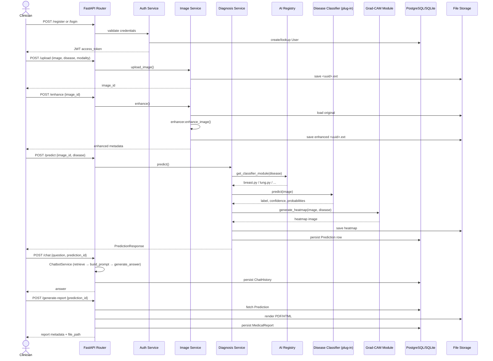
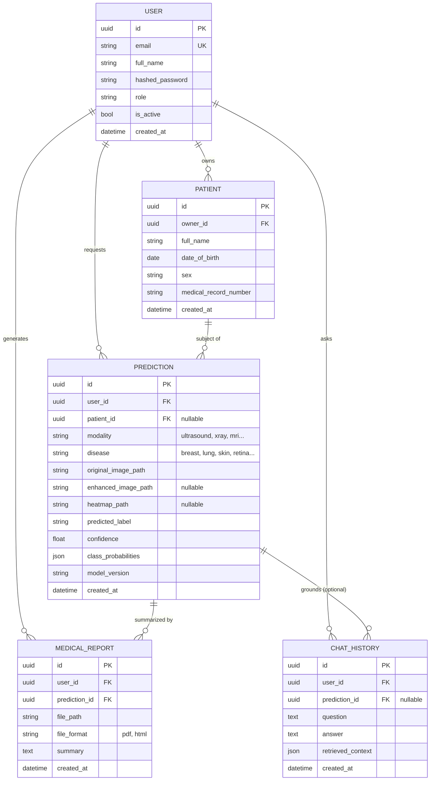

# CU AI Nexus — Backend

Modular, production-ready backend infrastructure for the **CU AI Nexus** medical AI
platform. It ships with a complete REST API, database layer, JWT auth, Docker
setup, and tests — but **no trained AI models**. Every inference point (image
enhancement, disease classification, Grad-CAM, chatbot) is a clearly-marked
placeholder interface that an AI engineer plugs a real model into, without
touching the API, database, or service layers.

Initial coverage targets **breast ultrasound** classification (aligned with the
`BUSI_Breast_Ultrasound_Classification` notebook in this repo), with `lung`,
`skin`, and `retina` already scaffolded as templates — adding any future
disease/modality is a one-file change (see [Adding a new disease](#adding-a-new-disease)).

---

## Table of Contents

1. [Folder Structure](#folder-structure)
2. [Architecture](#architecture)
3. [API Flow Diagram](#api-flow-diagram)
4. [Database Schema (ERD)](#database-schema-erd)
5. [Endpoint Documentation](#endpoint-documentation)
6. [Adding a New Disease](#adding-a-new-disease)
7. [Getting Started](#getting-started)
8. [Testing](#testing)
9. [Docker](#docker)
10. [Best Practices Used](#best-practices-used)
11. [Future Scalability Recommendations](#future-scalability-recommendations)

---

## Folder Structure

```
backend/
├── app/
│   ├── main.py                  # FastAPI app factory, lifespan, middleware wiring
│   │
│   ├── core/                    # Cross-cutting concerns
│   │   ├── config.py            #   Settings (.env-driven), storage paths
│   │   ├── security.py          #   JWT creation/decoding, bcrypt password hashing
│   │   ├── logging.py           #   Centralized logging configuration
│   │   └── exceptions.py        #   Domain exceptions + global FastAPI handlers
│   │
│   ├── database/                # Persistence infrastructure
│   │   ├── session.py           #   SQLAlchemy engine/session, get_db() dependency
│   │   ├── base.py               #   Declarative Base (no model imports — avoids cycles)
│   │   └── repositories/        #   Repository Pattern: one repo per aggregate
│   │       ├── base_repository.py
│   │       ├── user_repository.py
│   │       ├── patient_repository.py
│   │       ├── prediction_repository.py
│   │       ├── report_repository.py
│   │       └── chat_repository.py
│   │
│   ├── models/                  # SQLAlchemy ORM models (UUID primary keys)
│   │   ├── __init__.py          #   Registers all models on Base.metadata
│   │   ├── user.py
│   │   ├── patient.py
│   │   ├── prediction.py
│   │   ├── report.py
│   │   └── chat_history.py
│   │
│   ├── schemas/                 # Pydantic request/response models (API contracts)
│   │   ├── auth.py / user.py / image.py / prediction.py
│   │   └── chat.py / report.py / history.py
│   │
│   ├── ai/                      # ★ Modular AI plug-in layer — see below ★
│   │   ├── base.py               #   Abstract interfaces every AI module implements
│   │   ├── registry.py           #   Disease -> module registry (the plug-in mechanism)
│   │   ├── classification/       #   One file per disease
│   │   │   ├── breast.py         #     Reference implementation, fully annotated
│   │   │   ├── lung.py
│   │   │   ├── skin.py
│   │   │   └── retina.py
│   │   ├── enhancement/
│   │   │   └── enhancer.py       #   load_model() / enhance_image()
│   │   ├── gradcam/
│   │   │   └── gradcam.py        #   generate_heatmap()
│   │   └── chatbot/
│   │       └── rag_pipeline.py   #   retrieve_context() / build_prompt() / generate_answer()
│   │
│   ├── services/                # Business logic (orchestrates AI + repositories)
│   │   ├── auth_service.py
│   │   ├── image_service.py
│   │   ├── diagnosis_service.py
│   │   ├── chatbot_service.py
│   │   ├── report_service.py
│   │   └── history_service.py
│   │
│   ├── api/
│   │   ├── deps.py              # Dependency injection: get_db, get_current_user
│   │   └── v1/                  # Versioned routers — thin, no business logic
│   │       ├── router.py         #   Aggregates all routers under /api/v1
│   │       ├── auth.py / images.py / diagnosis.py
│   │       └── chatbot.py / reports.py / history.py / health.py
│   │
│   ├── middleware/
│   │   ├── cors.py
│   │   ├── logging_middleware.py
│   │   └── error_handler.py
│   │
│   ├── utils/                   # Small, dependency-light helpers
│   │   ├── db_types.py           # Cross-DB (SQLite/Postgres) UUID column type
│   │   ├── file_utils.py         # Upload validation & saving
│   │   ├── image_utils.py        # PIL helpers (framework-agnostic)
│   │   ├── storage_lookup.py     # Resolve a file on disk by its UUID
│   │   └── id_generator.py
│   │
│   └── storage/                 # Runtime file storage (gitignored contents)
│       ├── uploads/ | enhanced/ | heatmaps/ | reports/
│
├── alembic/                     # DB migrations (env.py wired to app settings + models)
├── tests/                       # pytest suite (14 tests, all passing)
├── models/                      # Mount point for trained model weight files
├── requirements.txt
├── Dockerfile
├── docker-compose.yml           # api + postgres + migrate services
├── alembic.ini
└── .env.example
```

### Why each folder exists

| Folder | Responsibility |
|---|---|
| `core/` | Settings, security primitives, logging, exceptions — nothing here knows about HTTP or the database schema. |
| `database/` | Engine/session lifecycle + the **Repository Pattern**, so services never write raw SQLAlchemy queries inline. |
| `models/` | The persisted shape of the data. Deliberately dumb — no business logic. |
| `schemas/` | The *public contract* of the API. Decoupled from `models/` so internal schema changes don't leak into responses. |
| `ai/` | The entire point of this architecture: every AI capability is an interface + a registry, so new models/diseases are additive, not invasive. |
| `services/` | Where business rules live: orchestrates repositories + AI modules, raises domain exceptions. |
| `api/` | Thin HTTP layer: parses requests, calls one service method, returns the response. No logic. |
| `middleware/` | Cross-cutting request/response behavior (CORS, logging). |
| `utils/` | Stateless helpers with no framework or business dependencies. |
| `storage/` | Where uploaded/generated files physically live (swap for S3/GCS in production — see [Scalability](#future-scalability-recommendations)). |

---

## Architecture

This backend follows **Clean Architecture** with strict one-directional
dependencies:

```
API (routers)  →  Services (business logic)  →  Repositories (data access)  →  Models (ORM)
                          ↓
                    AI Registry  →  AI Modules (classification / enhancement / gradcam / chatbot)
```

Rules enforced by this structure:

- **Routers never touch the database or AI modules directly.** They parse/validate
  input (via Pydantic schemas), call exactly one service method, and return its result.
- **Services never know about HTTP.** They raise `AppException` subclasses
  (`NotFoundException`, `ModelNotAvailableException`, etc.) which a global
  exception handler translates into the right HTTP status code.
- **Services never write SQL/ORM queries directly.** They depend on
  repositories, which encapsulate all query logic (Repository Pattern).
- **The API layer never imports from `app.ai.classification.*` directly.** It goes
  through `app.ai.registry`, so the set of supported diseases can grow without
  any router/service code changes.
- **Dependency Injection** is used throughout via FastAPI's `Depends()` —
  `get_db` (DB session) and `get_current_user` (JWT-authenticated user) are
  injected into every protected route, making handlers trivially testable by
  overriding `app.dependency_overrides`.

---

## API Flow Diagram

End-to-end flow for the core diagnostic journey (upload → enhance → predict → report):



---

## Database Schema (ERD)

All primary keys are **UUIDs** (cross-database `GUID` type — native `UUID` on
Postgres, `CHAR(36)` on SQLite).



**Design notes:**

- `Prediction.modality` and `Prediction.disease` are free-text strings (not
  enums/foreign keys) so adding a new disease **never requires a migration** —
  only a new file in `app/ai/classification/`.
- Uploaded/enhanced images are **not** modeled as a separate DB table. They're
  stored on disk as `<uuid><ext>` and resolved by id (`app/utils/storage_lookup.py`).
  This avoids an "Image" table whose only job would be tracking a filename;
  once an image is used in a `Prediction`, its resolved path is persisted
  permanently on that row for traceability.

---

## Endpoint Documentation

All endpoints are mounted under `/api/v1`. Interactive docs: `/docs` (Swagger)
and `/redoc`. Endpoints marked 🔒 require `Authorization: Bearer <token>`.

### Authentication

| Method | Path | Request | Response |
|---|---|---|---|
| POST | `/api/v1/register` | `UserRegisterRequest {email, full_name, password}` | `TokenResponse {access_token, token_type, expires_in_minutes}` |
| POST | `/api/v1/login` | `UserLoginRequest {email, password}` | `TokenResponse` |
| GET 🔒 | `/api/v1/me` | — | `UserResponse {id, email, full_name, role, is_active, created_at}` |

### Images

| Method | Path | Request | Response |
|---|---|---|---|
| POST 🔒 | `/api/v1/upload` | multipart: `file`, `disease`, `modality` | `ImageUploadResponse {image_id, original_filename, stored_path, modality, disease, uploaded_at}` |
| POST 🔒 | `/api/v1/enhance` | `EnhanceImageRequest {image_id, disease}` | `EnhanceImageResponse {image_id, enhanced_path, model_version, processed_at}` |
| GET 🔒 | `/api/v1/enhanced/{image_id}` | — | `EnhanceImageResponse` |

### Diagnosis

| Method | Path | Request | Response |
|---|---|---|---|
| POST 🔒 | `/api/v1/predict` | `PredictionRequest {image_id, disease, patient_id?, generate_heatmap}` | `PredictionResponse {id, disease, modality, predicted_label, confidence, class_probabilities, heatmap_path, model_version, created_at}` |
| GET 🔒 | `/api/v1/prediction/{prediction_id}` | — | `PredictionResponse` |

### Chatbot

| Method | Path | Request | Response |
|---|---|---|---|
| POST 🔒 | `/api/v1/chat` | `ChatRequest {question, prediction_id?}` | `ChatResponse {id, question, answer, retrieved_context, created_at}` |

### Reports

| Method | Path | Request | Response |
|---|---|---|---|
| POST 🔒 | `/api/v1/generate-report` | `GenerateReportRequest {prediction_id, file_format}` | `ReportResponse {id, prediction_id, file_path, file_format, summary, created_at}` |
| GET 🔒 | `/api/v1/report/{report_id}` | — | `ReportResponse` |

### History

| Method | Path | Request | Response |
|---|---|---|---|
| GET 🔒 | `/api/v1/history` | query: `skip`, `limit` | `HistoryListResponse {items: [...], total}` |
| DELETE 🔒 | `/api/v1/history/{prediction_id}` | — | `204 No Content` |

### Health

| Method | Path | Response |
|---|---|---|
| GET | `/api/v1/health` | `{status: "ok", timestamp}` |

Every endpoint: validates input via Pydantic, delegates to exactly one service
method, and lets domain exceptions (`NotFoundException` → 404,
`AlreadyExistsException` → 409, `InvalidCredentialsException`/`UnauthorizedException`
→ 401, `ForbiddenException` → 403, `InvalidFileException` → 422,
`ModelNotAvailableException` → 503) map to HTTP responses automatically via
the global exception handler in `app/core/exceptions.py`.

---

## Adding a New Disease

This is the core design goal of the platform. To add, say, **brain MRI**:

1. Create `app/ai/classification/brain_mri.py`:
   ```python
   disease_key = "brain_mri"
   labels = ["no_tumor", "glioma", "meningioma", "pituitary"]
   model_version = "v1"

   def load_model(): ...
   def preprocess(image): ...
   def predict(image) -> ClassificationResult: ...
   ```
2. Register it in `app/ai/registry.py`:
   ```python
   _REGISTRY["brain_mri"] = "app.ai.classification.brain_mri"
   ```
3. (Optional) Add its modality label in `app/services/diagnosis_service.py`'s
   `_MODALITY_BY_DISEASE` map.

**Nothing else changes.** `/upload`, `/predict`, `/prediction/{id}`, Grad-CAM,
reports, and history all work immediately for the new disease, because they
only ever call through `app.ai.registry.get_classifier_module()`.

---

## Getting Started

```bash
cd backend
cp .env.example .env               # adjust SECRET_KEY etc.
pip install -r requirements.txt
uvicorn app.main:app --reload      # http://localhost:8000/docs
```

By default, `DATABASE_URL` points at a local SQLite file — zero setup needed.
Switch to Postgres by setting `DATABASE_URL` in `.env` (see the example) and
running `alembic upgrade head`.

## Testing

```bash
pytest tests/ -v
```

14 tests covering auth (register/login/duplicate-email/bad-password/`/me`),
image upload/validation/enhancement, prediction (including the 503 path for an
unregistered disease), and the chatbot endpoint — all passing against an
isolated in-memory SQLite database per test.

## Docker

```bash
docker compose up --build          # API on :8000, Postgres on :5432
docker compose run --rm migrate    # apply Alembic migrations
```

---

## Best Practices Used

- **Clean Architecture** with one-directional dependencies (API → Services → Repositories → Models).
- **Repository Pattern** isolating all ORM queries from business logic.
- **Dependency Injection** via FastAPI `Depends()` for DB sessions and auth.
- **Strategy/Registry Pattern** for AI models — the registry decouples "which disease" from "how to run it."
- **Type hints everywhere**, Pydantic v2 schemas for all I/O contracts.
- **Async endpoints** for I/O-bound routes (upload, DB-agnostic paths kept sync where SQLAlchemy's sync engine is used, per current SQLAlchemy 2.0 style).
- **Centralized exception handling** — services raise domain exceptions, never `HTTPException`, keeping them transport-agnostic and unit-testable without FastAPI.
- **Centralized logging** with a request-timing middleware.
- **Environment-driven configuration** (`pydantic-settings`), no hardcoded secrets.
- **Cross-database UUID type** so the same models run on SQLite (dev) and PostgreSQL (prod) unchanged.
- **Deterministic, clearly-labeled placeholder AI outputs** — every stub is documented with a `TODO(AI engineer)` block showing exactly what real code should replace it with.

## Future Scalability Recommendations

- **Storage**: swap `app/storage/*` local disk for S3/GCS/Azure Blob behind the
  same `save_upload_file` / `find_file_by_id` interface — only `app/utils/file_utils.py`
  and `storage_lookup.py` would need to change.
- **Async inference**: move `/predict`, `/enhance`, and Grad-CAM generation to a
  task queue (Celery/RQ/Arq + Redis) with a `202 Accepted` + polling/webhook
  pattern once real models introduce non-trivial latency or need GPU workers.
- **Model serving**: extract `app/ai/classification/*` into standalone model-serving
  processes (TorchServe, Triton, or a lightweight FastAPI microservice per
  model) and have the registry call them over HTTP/gRPC instead of importing
  Python modules in-process — enables independent scaling/versioning per disease.
- **Caching**: cache `GET /prediction/{id}` and `GET /report/{id}` responses
  (Redis) since predictions/reports are immutable once created.
- **Rate limiting & quotas**: add per-user rate limiting (e.g. `slowapi`) ahead
  of expensive inference endpoints.
- **Observability**: replace the custom logging middleware with OpenTelemetry
  tracing + structured logs (the `LOG_JSON` flag in `core/logging.py` is a
  first step toward this) once running with multiple replicas.
- **Multi-tenancy**: if CU AI Nexus serves multiple hospitals, add a
  `tenant_id` column across `User`/`Patient`/`Prediction` and enforce it in the
  repository layer's query filters.
- **Refresh tokens**: `ACCESS_TOKEN_EXPIRE_MINUTES`/`REFRESH_TOKEN_EXPIRE_MINUTES`
  are already in `core/config.py` — add a `/refresh` endpoint and a
  `RefreshToken` table (with revocation) as the user base grows.
- **CI/CD**: add a GitHub Actions workflow running `pytest` + `docker build` on
  every PR; the test suite already runs in ~4 seconds with zero external
  dependencies, so it's cheap to gate merges on.

---

## Disclaimer

This platform is intended to **assist**, not replace, qualified medical
professionals. All AI inference in this repository is currently a placeholder;
no clinical decisions should be made based on it until real, validated models
are integrated and appropriately certified for clinical use.
